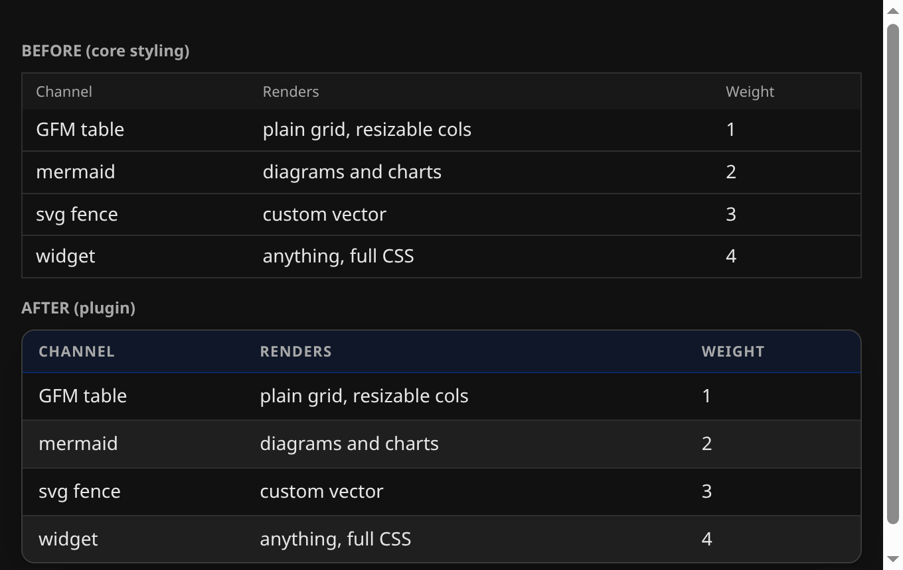

# Hermes Better Tables

[](LICENSE)

A Hermes Desktop plugin that restyles markdown tables. Rounded card, a tinted
uppercase header, zebra rows, and row hover, in the transcript, in tool details,
and in the file preview rail.



## Install

One file in one folder, and the folder name has to match the plugin id. Cloning
into the plugins directory lands it under that name:

```bash
cd ~/.hermes/desktop-plugins
git clone https://github.com/BrokeSkill/hermes-betterTables nice-tables
```

Windows PowerShell:

```powershell
cd $env:LOCALAPPDATA\hermes\desktop-plugins
git clone https://github.com/BrokeSkill/hermes-betterTables nice-tables
```

Without git, create `desktop-plugins/nice-tables/` by hand and put the repo's
`desktop/plugin.js` in it. The app watches that folder and picks the file up
within a few seconds. To force it, press Ctrl/Cmd+K and run **Reload desktop
plugins**.

<details>
<summary>Uninstall</summary>

```bash
rm -rf ~/.hermes/desktop-plugins/nice-tables
```

Then reload desktop plugins. Deleting an older copy installed under a different
folder name matters too, or the app loads both.

</details>

## Usage

Nothing to configure. Once the plugin is loaded, markdown tables render with the
new look everywhere they appear.

Toggle it any time in **Settings -> Plugins -> Better Tables**. Off returns tables
to the stock styling instantly.

## Notes

Colors come from the app's theme tokens, so the plugin follows whatever theme
you run, light or dark. It styles tables only; it does not touch other markdown.

## License

MIT. See [LICENSE](LICENSE).
